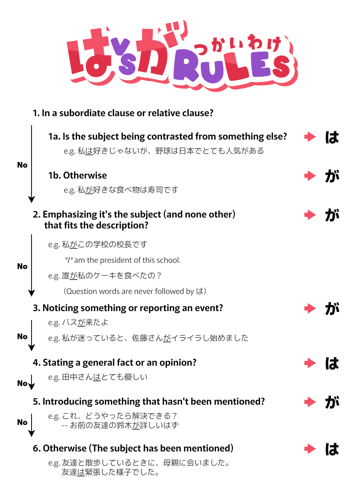

+++
title = 'When to use は vs が?'
date = 2025-01-02T16:00:00+09:00
draft = false
tags = ['japanese', 'language']
+++

Note: This chart is not comprehensive; it's meant to be a basis upon which beginners can learn exceptions and more minor usages of は and が.

Also, these discussions about は and が might give the impression they're the same kind of particles, but they're not. が belongs to the same category as を, に, で and they show the grammatical role (e.g. subject) of a noun in relation to the verb. On the other hand, は groups with も, こそ, etc. and they function at a different level. 
That knowledge, however, doesn't tell you which to use in all cases. In fact, you'll often encounter situations where it feels like you could use either. That's when you can use this chart.

Vocab:
- : baseball
- がある: popular
- : sushi
- : school president
- ケーキ: cake
- バス: bus
- イライラする: get annoyed/frustrated
- 始める: start
- しい: kind, nice
- する: solve
- しい: knowledgeable
- する: go for a walk
- する: get nervous
- だ: seem/look

Q. What is a subordinate clause?

A. Let's consider this English sentence: "I ate a cake because I was hungry". Here, "I ate a cake" is the *main* clause and "I was hungry" is a subordinate clause, which adds additional information to the main clause. Same applies to Japanese, where particles like から (because), けど (although), とき (when) form a subordinate clause. The earlier sentence would be: "お腹が空いていたから、ケーキを食べた。". Do note the order is opposite; what comes *before* から is the subordinate clause.

Q. What is a relative clause?

A. Again, relative clauses also exist in English so let's look at an English example: "She ate the cake that I bought". Here, the additional clause "that I bought" is explaining (modifying) the noun "cake". Such a clause is called a relative clause. To use a relative clause in Japanese, you just put it before a noun. The above example would be: "彼女は**私が買った**ケーキを食べた。" (Bold part is the relative clause).

## Why did I make this chart?

Whenever someone asked me when to use は vs が, all I could do was shrug off and say "it's complicated". I know about the common simplified explanation that goes "は emphasizes what follows vs が emphasizes the subject", but it felt too simplified to be really useful.

So I made the chart. It's based on this chart below from the book 中上級を教える人のための日本語文法ハンドブック but I simplified it even further. I tried to strike the balance between beginner-friendly, and not too dumbed-down to the point of being misleading. 



## Further Reading

- [は vs. が | Japanese with Anime](https://www.japanesewithanime.com/2019/07/wa-vs-ga.html)
  - Goes into detailed nuances using many examples.
